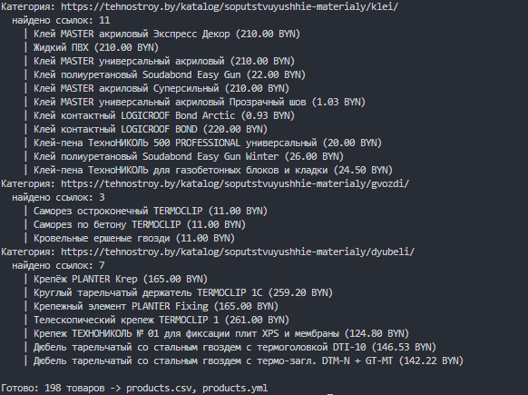
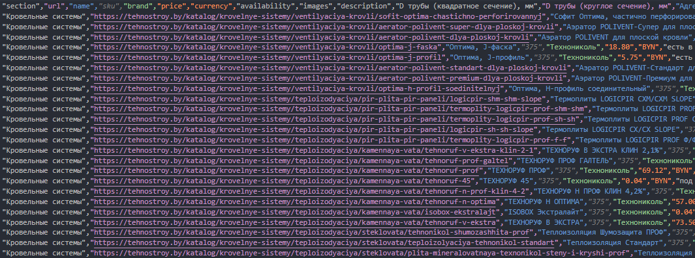
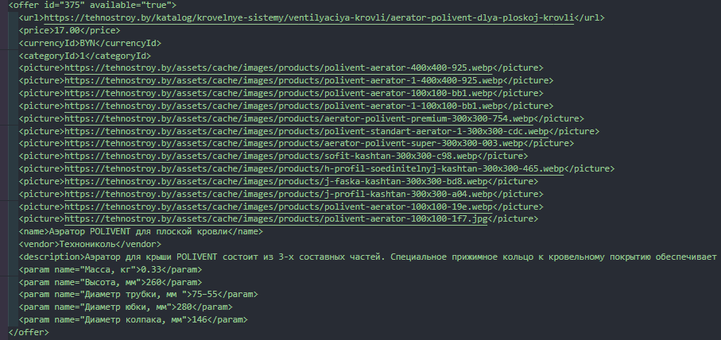

# tehnostroy-parser
Парсер каталога интернет-магазина: категории, товары, характеристики, экспорт в CSV и YML.

## Демострация
**Console:**

**CSV:**

**YML:**

## Технологии
- Python
- CSV   
- urljoin 
- xml
- requests
- BeautifulSoup 

## Установка и запуск
1. Клонируй репозиторий
2. Установи зависимости `pip install -r requirements.txt`
3. Запуск `python parser_tehnostroy.py` - Файлы сохраняются в папке редактора кода
